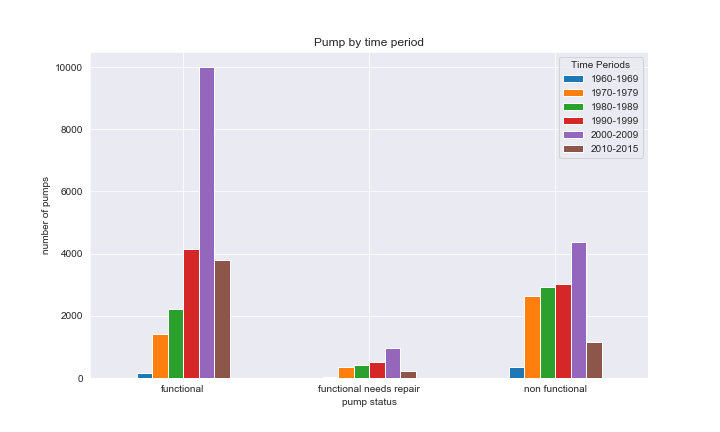

# Pump it Up: Data Mining the Water Table

## Data:


### The data was provided by Pump It Up: Data Mining the Water Table competition on Driven Data.
[https://www.drivendata.org/competitions/7/pump-it-up-data-mining-the-water-table/page/23/](https://www.drivendata.org/competitions/7/pump-it-up-data-mining-the-water-table/page/23/)

## Buisness Probelm

 The dataset consists of data on over 50,000 water wells from Taarifa and the Tanzanian Ministry of Water.  The objective is to predict which pumps are functional, which are functional and needs repairs and which are non functional.  The goal of this project is to use real data to construct a model ensemble methods that could as accurately as possible predict the functionality status of water pumps in Tanzania based on selected features.

## Exploratory data analysis

 In this section I answered some questions that i thought would be interesting to know about the water pumps in Tanzania based on our problem.

First i checked the value counts for the Pump Status of the training set


Functional: 54%


Non-Functional: 38%

Functional Needs Repairs: 7%

##  Does the age of the well relate to its functionality



the older the water pumps the more non-functional pumps there are vs. so much more functional water pumps that are still pretty new

## If you have to pay for water


there are more non functional where you don't have to pay vs. pumps that have a payment plan probably for the up keep of the pump to make sure that it is always functional.  A huge majority of people do not have to pay for their water.

## Best performing model

Decision Tree model

```
                         precision    recall  f1-score   support

             functional       0.78      0.78      0.78      6236
functional needs repair       0.32      0.32      0.32       799
         non functional       0.74      0.74      0.74      4483

               accuracy                           0.73     11518
              macro avg       0.61      0.61      0.61     11518
           weighted avg       0.73      0.73      0.73     11518
```


## Recommendations

*I would like to see more data on the average life span of water pumps to see if by a certain age you would already know when to check on it to see its functionality status.*

*I don't think that you would need to see which pumps are already dry since moslty all of the dry pumps are already non-functional.*

## Conclusion


Future work:


I would like to go back and deal with more of class imbalances using SMOTE.

look further into hyperparameter tuning with XGBoost

Try to perform binary label classification to see if it could improve accuracy.


```python

```
